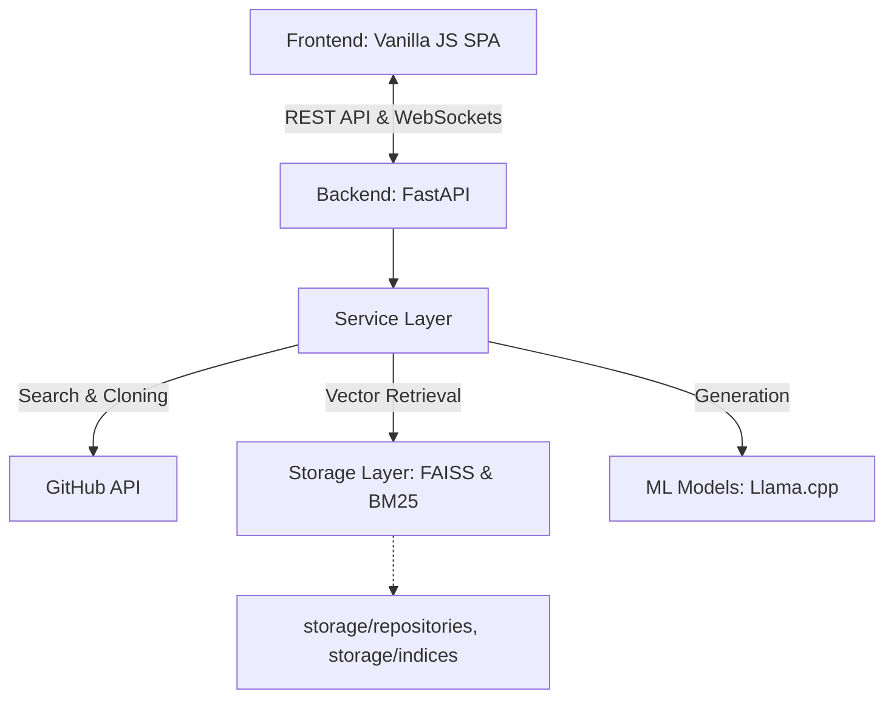

# Project Overview

The **RAG-Powered GitHub Assistant** is an AI-driven tool designed to help developers comprehend large codebases quickly. By utilizing Retrieval-Augmented Generation (RAG), the system indexes code repositories and allows users to query them using natural language. 

## High-Level Architecture

The system follows a classic client-server architecture with a clear separation of concerns, heavily relying on local/embedded processing for Machine Learning tasks.

## Technology Stack

### Backend
- **Framework:** FastAPI (Uvicorn ASGI server).
- **Language:** Python 3.9+
- **Data Validation:** Pydantic
- **Vector Search (Semantic):** FAISS-CPU (IndexFlatIP)
- **Keyword Search (Lexical):** rank-bm25
- **Embeddings:** `all-MiniLM-L6-v2` via `sentence-transformers`
- **LLM Inference:** `llama-cpp-python` (Supports GGUF models like CodeLlama, Phi-3, Llama-3.1).
- **Integrations:** PyGithub, GitPython.

### Frontend
- **Framework:** Pure Vanilla JavaScript (No React/Vue).
- **Styling:** CSS3 (Custom properties, CSS Grid/Flexbox) + Tailwind utility concepts.
- **Icons:** Lucide Icons.
- **State Management:** Custom object-based state (`this.state`).

### Storage Layer
The application uses local file-based storage heavily:
- `storage/repositories/`: Cloned bare/full git repositories.
- `storage/indices/`: Serialized FAISS binaries (`faiss_index.bin`) and BM25 pickles (`bm25_index.pkl`, `document_chunks.pkl`).
- `storage/metadata/`: JSON files tracking indexing tasks and repo stats.
- `backend/models/`: GGUF format LLM model weights.

## Data Flow Lifecycle
1. **Discovery:** User searches for a repository (Backend calls GitHub API).
2. **Indexing:** Backend clones the repo, chunks the source code, generates embeddings, and saves FAISS/BM25 indices to disk.
3. **Querying:** User asks a question. Backend retrieves relevant chunks via Hybrid Search, assembles a prompt with the context, and streams/returns the LLM's response.
